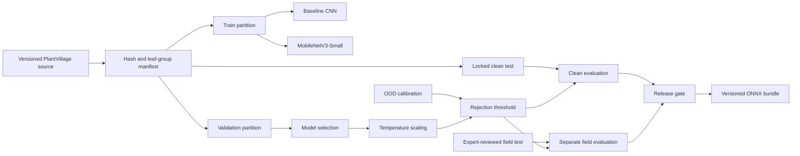
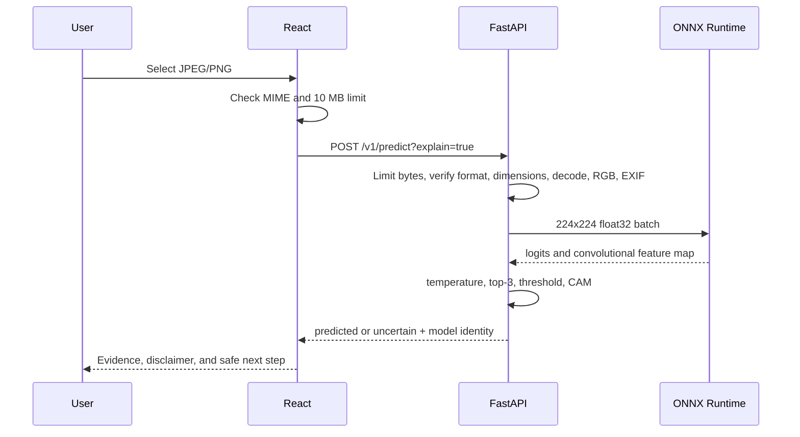

# Architecture

## Training and evidence flow

The test and field branches have no path back into training, selection, calibration,
or threshold fitting.

## Serving flow

## Boundaries

- The browser provides convenience validation; FastAPI is the security boundary.
- Model metadata is the single class/preprocessing/threshold contract.
- ONNX Runtime is the deployment runtime; TensorFlow is training-only after migration.
- Images are in-memory request data and are never persistent application state.
- Readiness fails when artifact, metadata, checksum, or runtime loading fails; liveness
  remains available for orchestration diagnostics.
- The legacy HDF5 adapter exists only until release 1.0 passes evidence gates.
